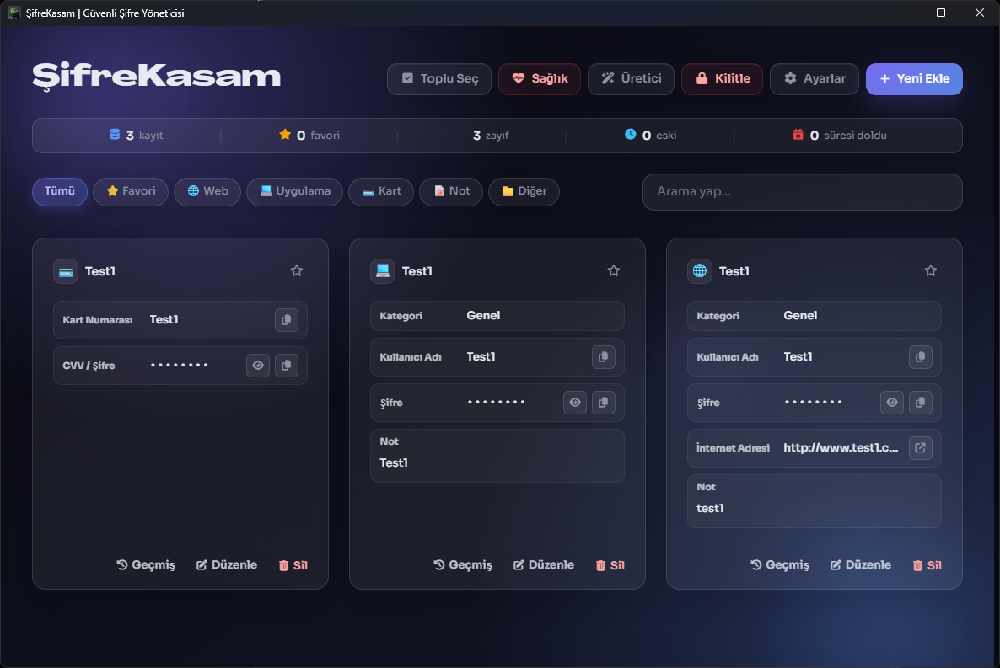
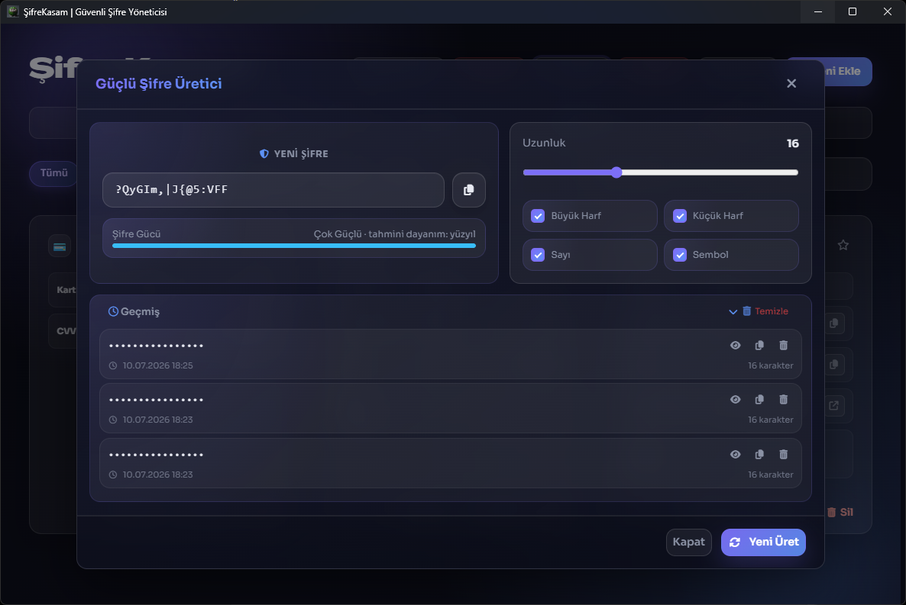
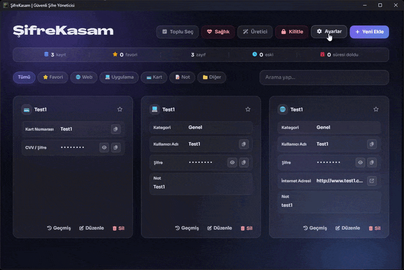

<div align="center">


# ŞifreKasam

**Yerel, açık kaynaklı masaüstü şifre yöneticisi**

Verilerinizi cihazınızda tutun ve ana şifrenizle şifreleyin.

<br>

[](README.md)
[](README_EN.md)

<br>

[](https://github.com/salvetum/SifreKasam/releases/latest)
[](https://github.com/salvetum/SifreKasam/releases)
[](LICENSE)
[](https://github.com/salvetum/SifreKasam/releases/latest)

<br>

[⬇️ Son Sürümü İndir](https://github.com/salvetum/SifreKasam/releases/latest)
&nbsp;•&nbsp;
[🐛 Hata Bildir](https://github.com/salvetum/SifreKasam/issues)

</div>

---

## ŞifreKasam Nedir?

**ŞifreKasam**, yerel çalışan bir masaüstü şifre yöneticisidir. Veriler cihazda tutulur, ana şifreyle şifrelenir ve uygulama Electron ile Flask tabanlı bir masaüstü paket olarak çalışır.

> Bu proje, yapay zekâ destekli geliştirme ve *vibe coding* sürecini deneyimlemek amacıyla başlatılmıştır.

## 📸 Ekran Görüntüleri

<div align="center">

### Ana Sayfa



<br><br>

<table>
  <tr>
    <td align="center" width="50%">
      <strong>Şifre Oluşturucu</strong>
      <br><br>
      
    </td>
    <td align="center" width="50%">
      <strong>Ayarlar Menüsü</strong>
      <br><br>
      
    </td>
  </tr>
</table>

</div>

## İndirme Kaynağı ve Güvenlik Uyarısı

Bu yazılımın resmî ve güvenilir dağıtımları yalnızca aşağıdaki bağlantı üzerinden yayımlanmaktadır:

**https://github.com/salvetum/SifreKasam**

Bu bağlantı dışında bulunan üçüncü taraf sitelerden, dosya paylaşım platformlarından, yeniden yüklenmiş paketlerden veya değiştirilmiş sürümlerden indirilen dosyaların güvenliği, bütünlüğü ve güncelliği garanti edilmez.

Resmî kaynak dışında indirilen sürümlerde oluşabilecek veri kaybı, zararlı yazılım, hesap güvenliği sorunları, sistem arızaları veya diğer zararlardan proje geliştiricisi sorumlu değildir.

İndirme yapmadan önce bağlantının resmî kaynağa ait olduğunu kontrol etmeniz önerilir.


## Özellikler

- Yerel veritabanı ve ana şifre ile şifreleme
- Kayıt ekleme, düzenleme, silme ve favorileme
- Şifre oluşturucu ve şifre sağlığı ekranı
- Türkçe / İngilizce dil desteği
- Koyu ve açık tema, glass efektleri, vurgu rengi ve arkaplan ayarları
- İçe/dışa aktarma, trayde çalışmaya devam etme ve otomatik kilitleme seçenekleri
- Github üzerinden versiyon kontrolü
> NOT: Yeni özellikler **gelmeyecektir**. Fakat Değişiklikler veya bug fixleri **olabilir** .

## ⚠️ Güvenlik Notları

> [!WARNING]
> Bu proje öncelikli olarak kişisel kullanım amacıyla geliştirilmiştir ve bağımsız bir güvenlik denetiminden geçmemiştir.

- Bağımsız bir güvenlik incelemesi yapılmadan ticari veya yüksek riskli kullanım için önerilmez.
- Ana şifrenizi unutursanız şifrelenmiş kayıtları kurtarmak mümkün olmayabilir.
- LAN erişimi geliştirme ve kolay yerel bağlantı amacıyla sunulmuştur.
- Güvenmediğiniz ağlarda LAN erişimini kapalı tutun.
- Repo'ya gerçek veritabanı, yedek, sertifika, özel anahtar veya kişisel kayıt dosyası yüklemeyin.

## 🛠️ Geliştirme

### Gereksinimler

- Node.js
- npm
- Python
- PyInstaller

### Repoyu Klonlama

```bash
git clone https://github.com/salvetum/SifreKasam.git
cd SifreKasam
```

### Bağımlılıkları Kurma

```bash
npm install
python -m pip install -r flask_app/requirements.txt
```

### Geliştirme Sürümünü Başlatma

```bash
npm start
```

### Windows Paketi Oluşturma

```bash
npm run package
```

### Flask Backend'i Paketleme

Aşağıdaki komutları `flask_app` klasöründe çalıştırın:

```bash
cd flask_app
pyinstaller app.spec --clean -y
```

## 📁 Repo'ya Dahil Edilmeyen Dosyalar

Aşağıdaki dosya ve klasörler bilinçli olarak Git dışında tutulur:

```text
node_modules/
backend/
out/
flask_app/build/
flask_app/dist/
flask_app/*.db
```

Bunlara ek olarak sertifikalar, özel anahtarlar, yedekler, geçici dosyalar ve kişisel veriler de repo dışında tutulur.

## 📜 Lisans

Bu proje **MIT Lisansı** altında yayımlanmaktadır.

Detaylar için [`LICENSE`](LICENSE) dosyasına bakabilirsiniz.

---

<div align="center">

ŞifreKasam açık kaynak olarak geliştirilmektedir.

⭐ Projeyi faydalı bulduysanız repoya yıldız bırakabilirsiniz.

</div>
